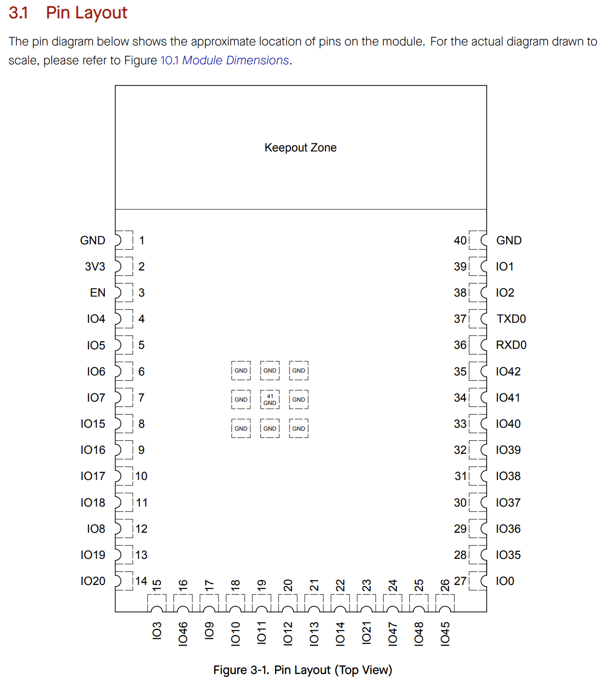

## Bluetooth Module's Selected Major Components

The following sections are the selected major components necessary for the A3 Bluetooth Subsystem. 

### Power Management

(**remove this note/placeholder**: this is where your 3.3 volt switching regulator, any other needed power regulator, and power source {if applicable} **THAT WERE SELECTED**)

For more details, review the ["Appendix - Component Selection Process - Power Management"](https://embedded-systems-design.github.io/EGR314DataSheetTemplate/Appendix/01-Componet-Selection/Component-Selection-Process/#power-management) selection.

## Major Component Selection

**External Clock Module**

*Table 1: Component selection*
| **Solution**                                                                                                                                                                                    | **Pros**                                                                                                                                    | **Cons**                                                                                            |
| ------------------------------------------------------------------------------------------------------------------------------------------------------------------------------------------------- | ------------------------------------------------------------------------------------------------------------------------------------------- | --------------------------------------------------------------------------------------------------- |
|  Option 1.  XC1259TR-ND surface mount crystal $1/each [link to product](http://www.digikey.com/product-detail/en/ECS-40.3-S-5PX-TR/XC1259TR-ND/827366)                 | \* Inexpensive[^1] \* Compatible with PSoC \* Meets surface mount constraint of project                                               | \* Requires external components and support circuitry for interface \* Needs special PCB layout. |
|  \* Option 2.  \* CTX936TR-ND surface mount oscillator  \* $1/each  \* [Link to product](http://www.digikey.com/product-detail/en/636L3I001M84320/CTX936TR-ND/2292940) | \* Outputs a square wave  \* Stable over operating temperature   \* Direct interface with PSoC (no external circuitry required) range | * More expensive  \* Slow shipping speed                                                |

**Choice:** Option 2: CTX936TR-ND surface mount oscillator

**Rationale:** A clock oscillator is easier to work with because it requires no external circuitry to interface with the PSoC. This is particularly important because we are not sure of the electrical characteristics of the PCB, which could affect the oscillation of a crystal. While the shipping speed is slow, according to the website, if we order this week, it will arrive within 3 weeks.

## Microcontroller Selection
### My Contribution to the Team
For this subsystem, I am responsible for creating a bluetooth subssystem, my goal is to send and receive information to a host bluetooth.

### ESP32-S3-WROOM-1-N4 pinout
 **Highlight the pins I plan to use or will be associated with my part**
  

### Rationale for the ESP
The ESP32-S3-WROOM-1-N4 was chosen primarily because it supports native BLE communication and is available in a surface-mount module, satisfying the project requirement that all components be Surface Mounted. The ESP32 provides sufficient processing power and peripherals for BLE client operation. Required pins for this project include 3.3V and GND.

## Power Budget
