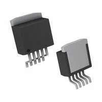
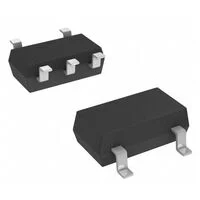
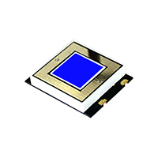
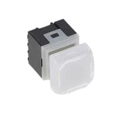
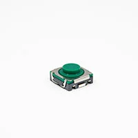
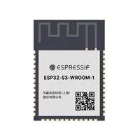
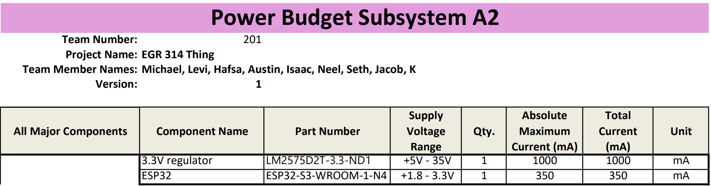
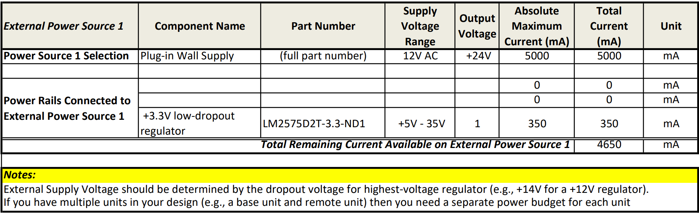

## Bluetooth Module's Selected Major Components

The following sections are the selected major components necessary for the A2 Bluetooth Subsystem. This subsystem primarily focuses on the Client stack in the main controller of the BLE system.

## Major Component Selection

### Power Management
 
*Table 1: Regulator selection*

| **Solution**                          | **Pros**                         |                       **Cons**                                    |
| ------------------------------------- | ------------------------------- | ------------------------------------------------------------------ |
|  Option 1.  LM2575D2T-3.3-ND1  $1.08/each [link to product](https://www.digikey.com/en/products/detail/onsemi/LM2575D2T-3-3R4/1476687)    | \* Inexpensive[^1] \* Compatible with ESP  \* 3.3 V 1 A  \* Already have in class.            | \* Requires external components and support circuitry for interface \* Needs special PCB layout. |
|  \* Option 2.  \* TL2575HV-33IKTTR  \* $4.46/each  \* [Link to product](https://www.digikey.com/en/products/detail/texas-instruments/TL2575HV-33IKTTR/1629212) | \* Buck Switching regulator  \* Stable over operating temperature   \* Texas Instruments  | * 400 left in stock  \* extremely expensive compared to option 1 and 3   |
|  \* Option 3.  \* TCR2EF33,LM(CT  \* $0.12/each  \* [Link to product](https://www.digikey.com/en/products/detail/toshiba-semiconductor-and-storage/TCR2EF33-LM-CT/4503183) | \* 6,657 in stock  \* Stable over operating temperature   \* 3.3 V 200mA | * 12 week manufacture lead time    \* Thermal issues if using high voltage.  |

**Choice:** Option #1: LM2575D2T-3.3-ND1

**Rationale:** Option 1 is the candidate because of its stats; it's rated for 3.3V 1A, although the current is a little high, the voltage is exactly at 3.3V, which is imperative for Subsystem A2 to work. Because this regulator costs $1.08 and is way under budget, I believe that LM2575D2T-3.3-ND1 can be the solution for my 3.3V needs. Also, we already have these in stock in the classroom.

### Debug Button

*Table 2: Component selection*

|                **Solution**            |                    **Pros**         |                            **Cons**                      |
| ----------------------------------------| ------------------------------------ | ------------------------------------------------------- |
|  Option 1.  CSMS15CIC06  $7.17/each [link to product](https://www.digikey.com/en/products/detail/visual-communications-company-vcc/CSMS15CIC06/8259508)                 | \* Most Visually pleasing for controller  \* Compatible with ESP  \* Meets surface mount constraint of project  \* No mechanical lifespan, unlimited cycles       | \* Real Expensive  \* Needs special PCB layout. |
|  \* Option 2.  \* KP0415ASG03RGBW-2SJB  \* $16.44/box  \* [Link to product](https://www.digikey.com/en/products/detail/nkk-switches/KP0415ASG03RGBW-2SJB/16351327) | \* illuminated for style points   \* 3 million cycle lifespan | * 18 in stock  \* may require extra circuitry   \* Comes in box with unknown # |
|  \* Option 3.  \* TL9320AF400QG  \* $0.90/each  \* [Link to product](https://www.digikey.com/en/products/detail/e-switch/TL9320AF400QG/11698099?s=N4IgTCBcDaICoBkCcBmMAGAggMQCzvQEUBxEAXQF8g) | \* Cheapest of all  \* Plenty in stock  \* 500,000 cycles| \* no real negatives    |

**Choice:** Option 3: The TL9320AF400QG, is a  surface mounted button.

**Rationale:** The reason this button was chosen is because of its characteristics. This button can be used very easily with the controller on which Subsystem A2 is installed. It also has a lifespan of roughly 300,000 cycles, which is plenty of life for the project.

## Microcontroller Selection

*Table 3: Microcontroller selection*

| **Solution**                      |        **Facts**                   |                            **Contribution**                        |
| ---------------------------------- | ----------------------------------| -------------------------------------------------------------------|
|  Option 1.  ESP32-S3-WROOM-1-N4  $5.06/each [product link](https://www.digikey.com/en/products/detail/espressif-systems/ESP32-S3-WROOM-1-N4/16162639)       | \* Bluetooth, WiFi 802.11b/g/n, Bluetooth v5.0 Transceiver Module 2.4GHz PCB Trace Surface Mount  \* Meets surface mount constraint of subsystem A2     | \* For this subsystem, I am responsible for creating a Bluetooth subsystem. My goal is to send and receive information. Subsystem A2 is in charge of Bluetooth communication. We plan to use Bluetooth Low Energy (BLE) for this, and A3 will be the client on the controller side of the project.  |

### ESP32-S3-WROOM-1-N4 pinout

  

### Rationale for the ESP
The ESP32-S3-WROOM-1-N4 was chosen primarily because it supports native BLE communication and is available in a surface-mount module, satisfying the project requirement that all components be surface-mounted. The ESP32 provides sufficient processing power and peripherals for BLE client operation. Required pins for this project include 3.3V and GND.

## Power Budget
Below is screenshots of my power budget and a pdf can be downloaded [here](powerbudmk1.pdf). Also, a zipped .xlsx file can be found [here](powerbudmk1.zip).

  
  
  
