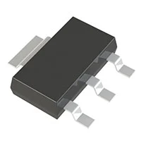
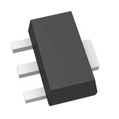
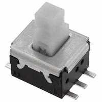
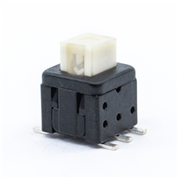

## Bluetooth Module's Selected Major Components

The following sections are the selected major components necessary for the A2 Bluetooth Subsystem. This subsystem primarily focuses on the Client stack in the main controller of the BLE system.

## Major Component Selection

### Power Management
 
*Table 1: Regulator selection*

| **Solution**                          | **Pros**                         |                       **Cons**                                    |
| ------------------------------------- | ------------------------------- | ------------------------------------------------------------------ |
|  Option 1.  AZ1117IH-3.3TRG1  $0.24/each [link to product](https://www.digikey.com/en/products/detail/diodes-incorporated/AZ1117IH-3-3TRG1/5699672)    | \* Inexpensive[^1] \* Compatible with ESP \* 3.3 V 1 A            | \* Requires external components and support circuitry for interface \* Needs special PCB layout. |
|  \* Option 2.  \* AS78L05RTR-E1  \* $0.13/each  \* [Link to product](https://www.digikey.com/en/products/detail/diodes-incorporated/AS78L05RTR-E1/4470943) | \* 1 output  \* Stable over operating temperature   \* very cheap  | * 5V 100mA  \* 24 week Manufacture lead time    |
|  \* Option 3.  \* TCR2EF33,LM(CT  \* $0.12/each  \* [Link to product](https://www.digikey.com/en/products/detail/toshiba-semiconductor-and-storage/TCR2EF33-LM-CT/4503183) | \* 6,657 in stock  \* Stable over operating temperature   \* 3.3 V 200mA | * 12 week manufacture lead time    |

**Choice:** Option #1: AZ1117IH-3.3TRG1

**Rationale:** Option 1 is the candidate because of its stats; it's rated for 3.3V 1A, although the current is a little high, the voltage is exactly at 3.3V, which is imperative for Subsystem A2 to work. Because this regulator costs \$0.24 cents, this fits fine within the \$60 budget.

### Debug Button

*Table 2: Component selection*

|                **Solution**            |                    **Pros**         |                            **Cons**                      |
| ----------------------------------------| ------------------------------------ | ------------------------------------------------------- |
|  Option 1.  CSMS15CIC06  $7.17/each [link to product](https://www.digikey.com/en/products/detail/visual-communications-company-vcc/CSMS15CIC06/8259508)                 | \* Most Visually pleasing for controller  \* Compatible with ESP  \* Meets surface mount constraint of project        | \* Real Expensive  \* Needs special PCB layout. |
|  \* Option 2.  \* ESB-33535A  \* $1.94/each  \* [Link to product](https://www.digikey.com/en/products/detail/panasonic-electronic-components/ESB-33535A/3873298) | \* Cheaper than Option 1  \* Over 2,000 in stock   \* SWITCH PUSH DPDT 0.2A 14V | * 18 week manufacture lead time  \* may require extra circuitry       |
|  \* Option 3.  \* TL2233OA  \* $0.46/each  \* [Link to product](https://www.digikey.com/en/products/detail/e-switch/TL2233OA/15220943) | \* Cheapest of all  \* SWITCH PB DPDT 0.1A 30V| \* 6-pins  \* 1,718 in stock    |

**Choice:** Option 1: The CSMS15CIC0, is a surface mounted display button.

**Rationale:** The reason this button was chosen is because of its characteristics. With a display button, you do not need to worry about the life cycle. The button has an IC, which means no moving parts, which is very good for reliability. Also, this button can very easily be used with the controller on which Subsystem A2 is placed.

## Microcontroller Selection

*Table 3: Microcontroller selection*

| **Solution**                      |        **Facts**                   |                            **Contribution**                        |
| ---------------------------------- | ----------------------------------| -------------------------------------------------------------------|
|  Option 1.  ESP32-S3-WROOM-1-N4  $5.06/each [product link](https://www.digikey.com/en/products/detail/espressif-systems/ESP32-S3-WROOM-1-N4/16162639)       | \* Bluetooth, WiFi 802.11b/g/n, Bluetooth v5.0 Transceiver Module 2.4GHz PCB Trace Surface Mount  \* Meets surface mount constraint of subsystem A2     | \* For this subsystem, I am responsible for creating a bluetooth subssystem, my goal is to send and receive information. Subsystem A2 is in charge of Bluetooth communication. We plan to use Bluetooth Low Energy (BLE) in this, and A3 will be the clientin the controller side of the project.  |

### ESP32-S3-WROOM-1-N4 pinout

  

### Rationale for the ESP
The ESP32-S3-WROOM-1-N4 was chosen primarily because it supports native BLE communication and is available in a surface-mount module, satisfying the project requirement that all components be surface-mounted. The ESP32 provides sufficient processing power and peripherals for BLE client operation. Required pins for this project include 3.3V and GND.

## Power Budget
N/A
