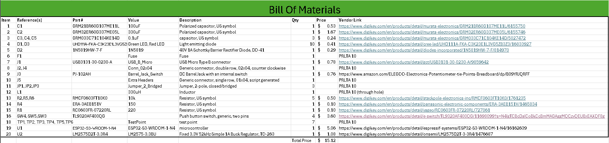

## Overview
This BOM contains all the parts needed to complete the setup of Subsystem A2. Overall, the class's cost constraint is $60, but this BOM includes both materials and links to each component. I have also included prices and quantity used as well as other information to help track the components on the schematic and PCB.

## Bill of Materials 

**Figure 01:** Bill of Materials screenshot.

As you can see, the text can be difficult to read without opening the image. Please feel free to click the image for better results.

## Resource

The Bill of Materials as a PDF download is available [*here*](bomk6.pdf).
