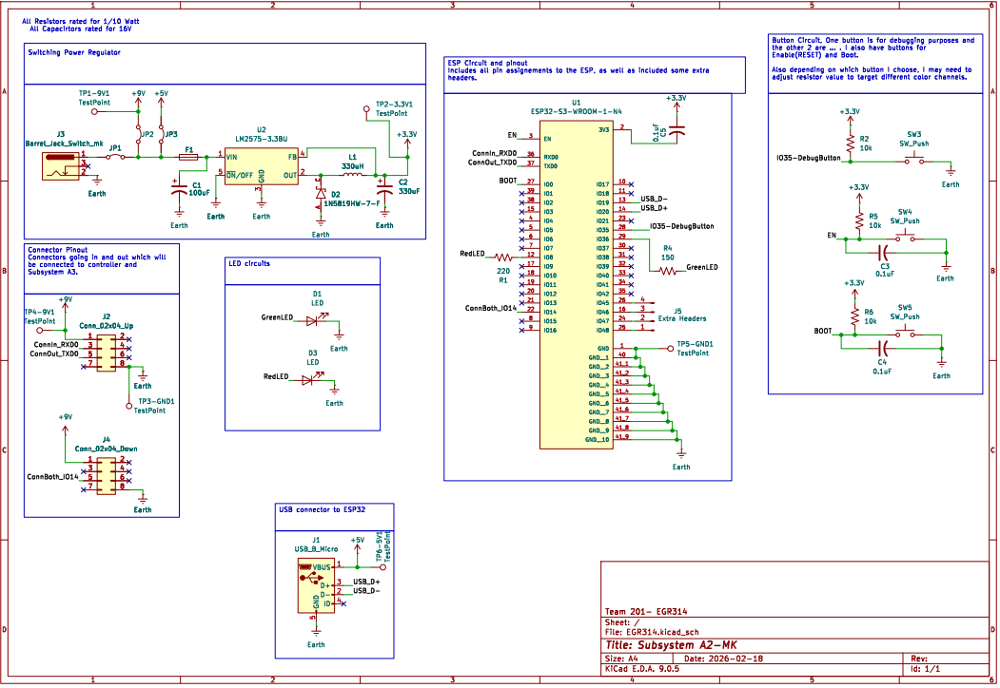

## Overview

This schematic is designed to support Subsystem A2. In the schematic, you will see how I designed a circuit to hold 5 buttons, a surface-mounted ESP32, and shared connections. connector pins, and a switching power regulator. As well as the design of supporting circuitry. To understand the basis of this schematic and why things are the way they are, you can refer to the team block diagram [*here*](https://egr314-s-2026-201.github.io/04-Team-Block-Diagram/Team-Diagram/).

**Figure 01:** Showing schematic of Subsystem A2.

## Resources
This schematic as a PDF is available for download [*here*](EGR314.pdf), and the project Zip file is [*here*](EGR314-mk-3.zip).
