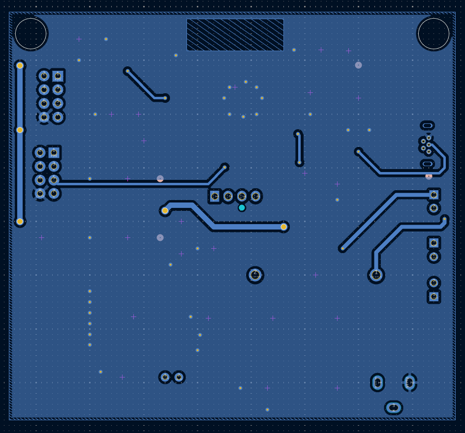
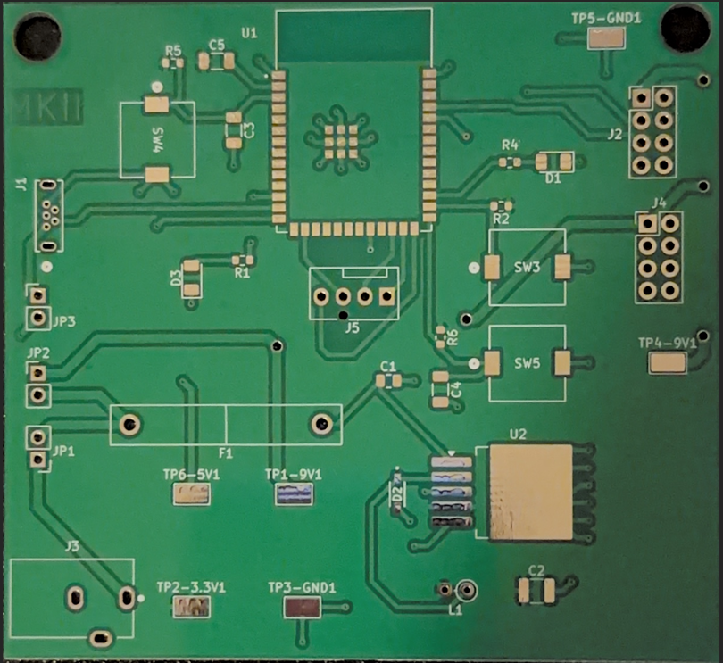
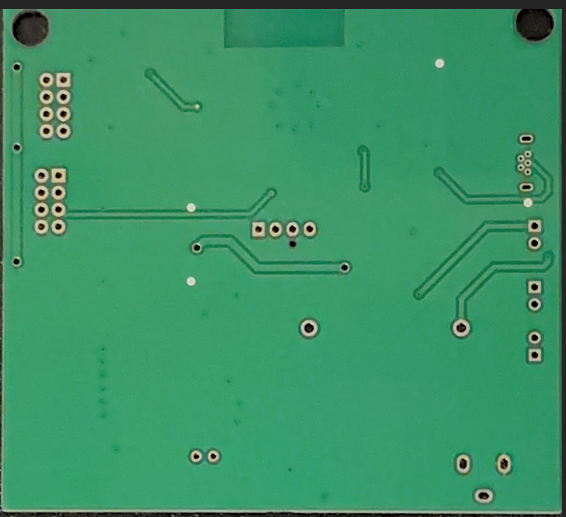
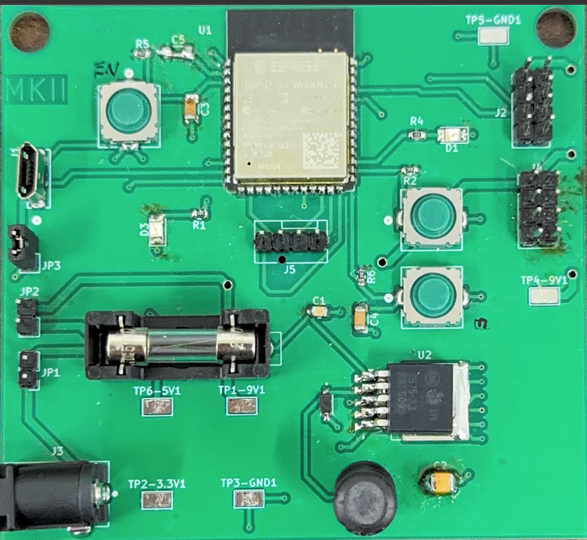
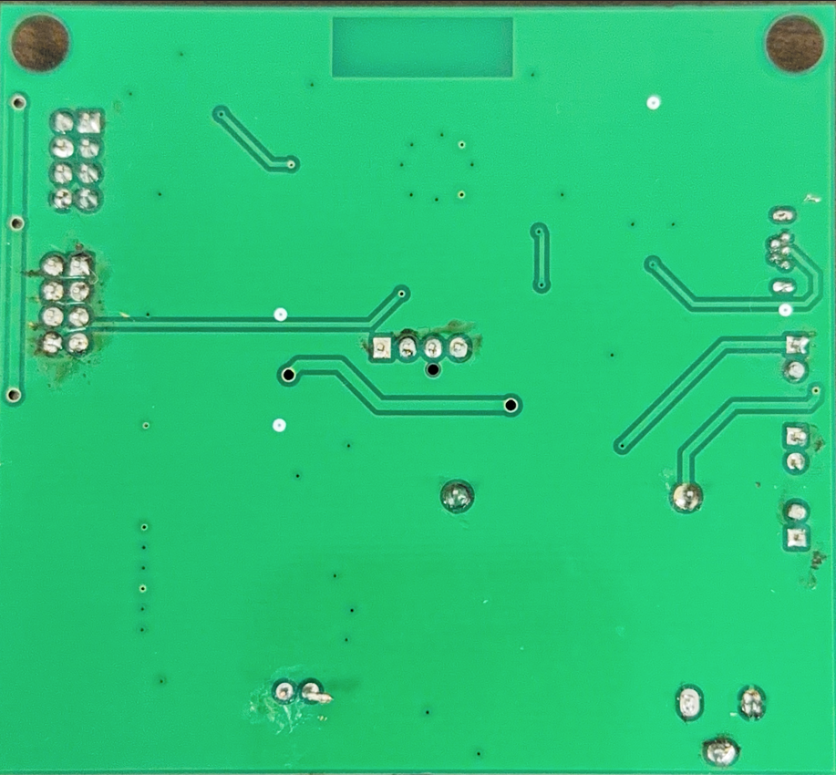

## PCB

This PCB is Subsystem A2; it is the BLE Client that is housed on the controller part of the team project. The main components include the ESP32 and buttons, as most of the work will be done on the Bluetooth communication. A major change is the addition of a majority of surface-mounted parts, which is a new constraint in the EGR 314 Project. If you would like to view more information about the team component, you can visit [team project requirements](https://egr314-s-2026-201.github.io/03-Project-Requirements/Project-requirements/).

## PCB Schematic View

 

**Figure 1:** Showing Subsystem A2 PCB Front

 

**Figure 2:** Showing Subsystem A2 PCB Rear

## Manufactured Board
The reason that the above schematics look different is because it is updated to reflect changes made through debugging the actual version 1 PCB. So the above schematic shows PCB v2 of subsytem A2, as the first version had some issues, such as no decoupling capacitor attached to the esp32, some added extra connections and rerouted Rx and Tx pins, as well as some spacing difference in the connector pins to allow the outside casing of the connector to fit, finally there were some updates to the traces of the test points. Everything below is from the first version of subsystem A2.

**Figure 4:** shows the Skeleton of the Top-side PCB

**Figure 5:** shows the Skeleton of the bottom-side PCB

**Figure 6:** shows the Top-side PCB

**Figure 7:** shows the bottom-side PCB

## Additional Info
The project files can be found in the previous tab in the [schematic section](https://mjkim21-dev.github.io/mjkim21.github.io/05-Schematic/schematic/). If you are looking for the Gerber files to get the PCB made, you can find them [here](Michael201.zip). For the v2 Gerber files, you can find them [here](.zip). 

