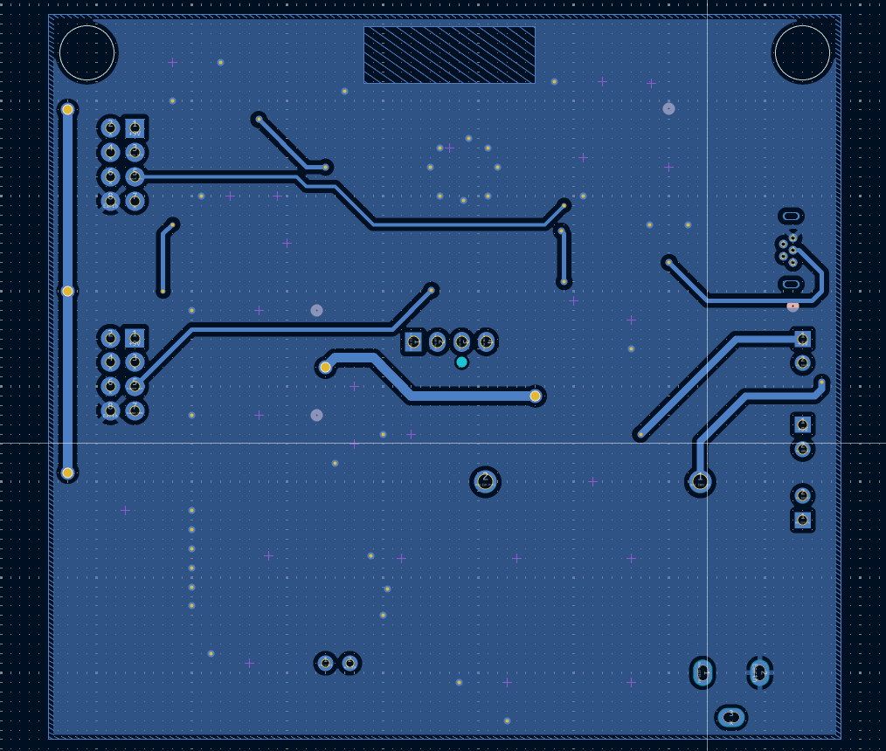

## Overview
The first version had some issues: no decoupling capacitor was attached to the ESP32, some extra connections were added, the Rx and Tx pins were rerouted, and there were spacing differences between the connector pins to allow the outer casing of the connector to fit. Finally, there were some updates to the traces of the test points. Everything below is from the first version of subsystem A2.

For a proper v2.0, this subsystem should be implemented with all the controller's capabilities. So, adding a screen to display the Bluetooth connection and the data, as well as having sufficient buttons to control.

## Updated Schematic

**Figure 01:** Showing schematic of Subsystem A2.

## Updated PCB
 

**Figure 1:** Showing Subsystem A2 PCB Front

 

**Figure 2:** Showing Subsystem A2 PCB Rear

## Files
To access the files, I have updated the original files to the [schematic](https://mjkim21-dev.github.io/mjkim21.github.io/06-Schematic/schematic/) and [PCB](https://mjkim21-dev.github.io/mjkim21.github.io/07-PCB/pcb/) sections. If you would like to reproduce this subsystem, please do not download "version 1 files". 
