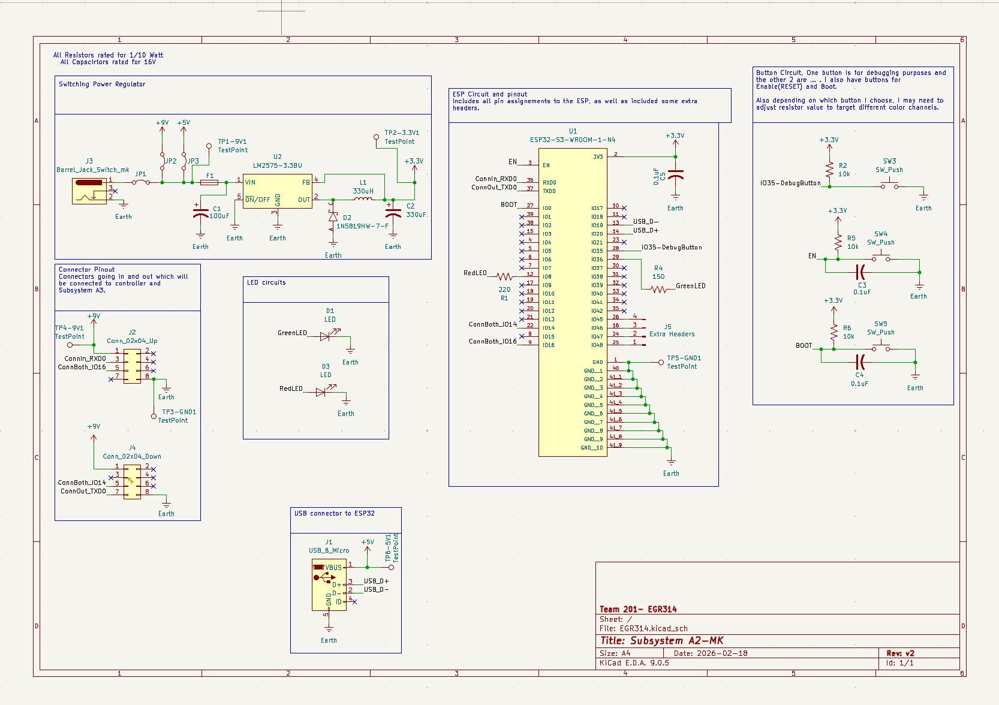
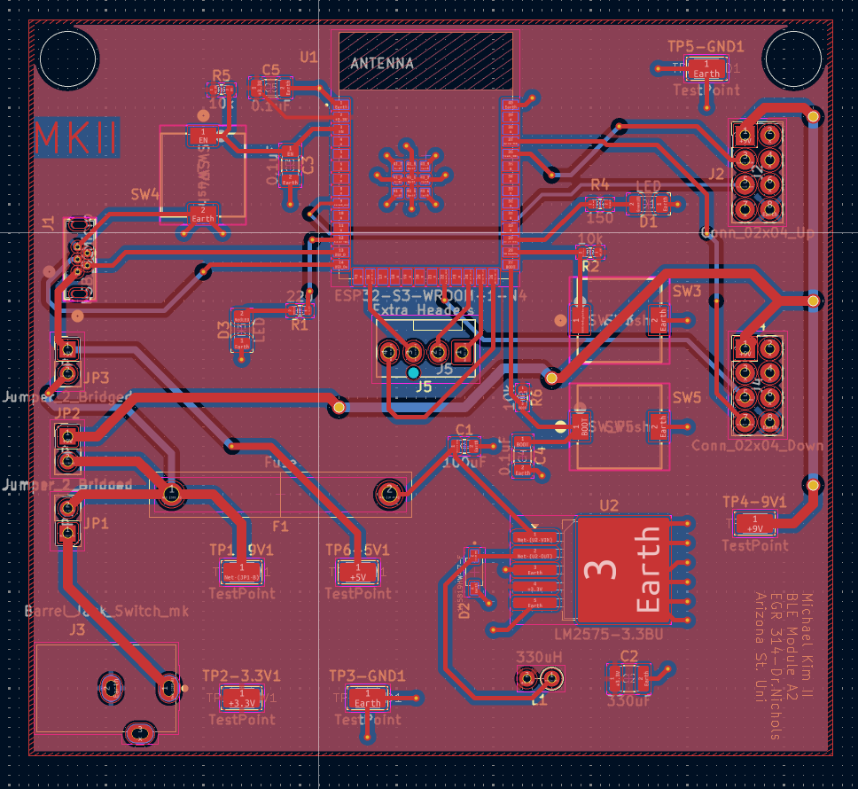

## Overview
the first version had some issues, such as no decoupling capacitor attached to the esp32, some added extra connections and rerouted Rx and Tx pins, as well as some spacing difference in the connector pins to allow the outside casing of the connector to fit, finally there were some updates to the traces of the test points. Everything below is from the first version of subsystem A2.

## Updated Schematic

**Figure 01:** Showing schematic of Subsystem A2.

## Updated PCB
 

**Figure 1:** Showing Subsystem A2 PCB Front

 

**Figure 2:** Showing Subsystem A2 PCB Rear
