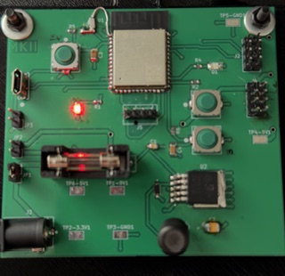

Michael Kim Datasheet 
as part of 
 The Duck  
for 
 Team 201  

**Submission: May 04, 2026**

## Introduction

This datasheet has all the information regarding subsystem A2, which I am responsible for. Navigating through the website will allow you to understand the processes I went through to design and build Subsystem A2, which is mostly in charge of the Bluetooth Low Energy (BLE) client. 

**Figure 1**: final subsystem A2

### Project Summary

My part in Team 201 will be crucial to the controller. I am solely responsible for the Bluetooth connection in the controller piece. My role is to receive and send data to and from the robot via Bluetooth. This subsystem, A2, will consist only of buttons and will serve a support role to Subsystem A1 to ensure the controller displays as much information as possible and has a working user interface. If you would like to get a better idea of just how this subsystem fits, check the [team report.](https://egr314-s-2026-201.github.io/)

### My Contribution

For this project, I am 1 out 10 people on Team 201. I am responsible for the BLE Client on the controller, so my responsibility is to design and build a circuit and PCB to run BLE out of the ESP32. As you navigate through the website, you will see all the way from concept generation to final code and pictures of the completed design.

Below you will find hyperlinks to the sections.  
1.["Requirements"](https://mjkim21-dev.github.io/mjkim21.github.io/01-Requirements/Requirements/)  
2.["Block-Diagram"](https://mjkim21-dev.github.io/mjkim21.github.io/02-Block-Diagram/Block-Diagram/)  
3.["Component Selection"](https://mjkim21-dev.github.io/mjkim21.github.io/03-Component-Selection/Component-Selection/)  
4.["BOM"](https://mjkim21-dev.github.io/mjkim21.github.io/04-BOM/BOM/)  
5.["Power Budget"](https://mjkim21-dev.github.io/mjkim21.github.io/05-Power%20Budget/powerbud/)  
6.["Schematic"](https://mjkim21-dev.github.io/mjkim21.github.io/06-Schematic/schematic/)  
7.["PCB design"](https://mjkim21-dev.github.io/mjkim21.github.io/07-PCB/pcb/)  
8.["API WebPage"](https://mjkim21-dev.github.io/mjkim21.github.io/08-API%20WebPage/api/)  
9.["Hardware 2.0"](https://mjkim21-dev.github.io/mjkim21.github.io/09-Hardware-V2.0/v2.0/)  
10.["Resources"](https://mjkim21-dev.github.io/mjkim21.github.io/10-Resources/resources/)  
11.["Reflection"](https://mjkim21-dev.github.io/mjkim21.github.io/11-Reflection/Reflection/)  
12.["Appendix"](https://mjkim21-dev.github.io/mjkim21.github.io/Appendix/appendix/)  

 

